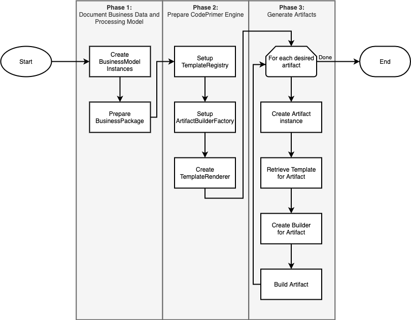

# CodePrimer Concepts
In order to use or extend CodePrimer, it is important to understand how it is working under the hood.

## Terminology
In order to properly understand the documentation and concepts, it is important to define the terminology used by CodePrimer.

### Data Model Terminology
- **Business Model** (`BusinessModel`): Describe data to manipulate from a **business point of view**. It must be specified by the CodePrimer user (e.g. *software architect, business analyst*) before generating artifacts. **This is a primary input used by CodePrimer (via a `BusinessBundle`) to generate various artifacts.** 
- **Business Bundle** (`BusinessBundle`): Regroup all `BusinessModel`, `DataSets`, `Events` and `BusinessProcesses` that are related to describe the business processing model. 
- **DataSet**: Fixed, known set of data elements available to include/use in `BusinessModel` as well as `BusinessProcesses`. This is similar to an *enum* in programming languages with multiple fields for each element.
- **Derived Model**: Subset of a `BusinessModel` used to generate a specific set of artifacts (e.g. entity, resource). Derived models are generated automatically by CodePrimer via an appropriate Adapter (see `/src/Adapter/`). As such, they are **not considered** as input from the user.  
- **Entity**: Derived model meant to be manipulated by the persistence layer (e.g. database)
- **Event**: Derived model meant to be exchanged between the various processing agents of the solution (e.g., worker, scheduled tasks). **An event must only be originated from a trusted component inside of our solution**. It must also **carry a ‘calling context’** to identify the source of the event in order to perform the necessary data validation and auditing imposed by a business process and ensure system integrity.
- **External Resource**: Derived model residing on an external system and can be consumed by a business process. It typically overlaps with parts of a business model but may also be a subset or a superset of a given business model
- **Resource**: Derived model meant to be exposed and consumed by external systems (e.g. via a REST API)

More details about CodePrimer's data model can be found [here](./DataModel.md).

### Template Generation Terminology
- **Adapter**: Converts a **primary input** (e.g. `BusinessModel`) into a derived representation (e.g. `Entity`, `Event`, etc.) so it can be easily manipulated by templates handling the derived element.
- **Artifact**: A document generated by CodePrimer (e.g. source code, documentation, test, etc.). **This is CodePrimer's primary output.**
- **Artifact Builder Factory** (`ArtifactBuilderFactory`): Factory used to create the appropriate `Builder` to use to generate a given artifact. 
- **Builder**: A builder coordinates the creation of a given set of artifacts by bringing together `BusinessBundle`, `Template`, `Renderer` and `Helpers` to apply the appropriate rules in the artifact generation process (e.g. file naming convention, output directory, etc.).
- **Helper**: Embeds CodePrimer's business rules used to extract/derive information from specific data model classes based on a given instance.
- **Renderer**: Locates and loads templates from the filesystem and drives Twig to generate a specific artifact for a given template.
- **Template**: Template file used to generate a given set of artifacts using Twig as the underlying engine.
- **Template Registry** (`TemplateRegistry`): Registry of all templates currently supported by CodePrimer along with methods to retrieve the proper template associated with an artifact to generate.

## Template Generation Flow
At a high level, generating artifacts using CodePrimer is illustrated below

**Phase 1**: Document Business Data Model
1. Create the various `BusinessModel` objects to describe your own data model.
2. Prepare the `BusinessBundle` to include all the elements that are related to your business process.

**Phase 2**: Prepare CodePrimer Rendering Engine 
1. Get/create an instance of the `TemplateRegistry` to use.
2. Get/create an instance of the `ArtifactBuilderFactory` to use.
3. Create a `TemplateRenderer`, specifying where templates are located as well as where artifacts must be generated.

**Phase 3**: Generate Desired Artifacts

For each artifact to generate:
1. Create an `Artifact` instance based on what you want to generate.
2. Retrieve the `Template` associated with the desired artifact from the `TemplateRegistry`.
3. Create the `Builder` associated with the desired artifact from the `ArtifactBuilderFactory`.
4. Build the desired artifact via the `Builder` created.