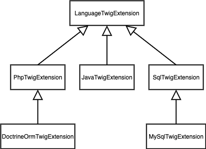

# CodePrimer Structure and Guidelines
In order to help people understand how to evolve the project, it is important to explain its overall structure and guidelines to ensure a smooth and consistent evolution.

## Repository Structure
The repository has the following structure:
- `/doc`: This folder holds the documentation intended for contributors and users to understand how to leverage and extend CodePrimer for their needs.
- `/fixtures`: This folder holds fixtures used as input by various automated tests.
- `/src`: This folder holds the source code of the CodePrimer project.
- `/templates`: This folder holds the list of artifact templates that can be generated by CodePrimer. 
- `/tests`: This folder holds the list of automated tests that are executed as part of the continuous integration process to ensure CodePrimer's stability. 

## Source Code Structure
The source code has the following structure:
- `/src/Adapter/`: Classes used to convert a `BusinessModel` into a derived representation (e.g. `Entity`, `Event`, etc.) used to populate a template. 
- `/src/Builder/`: Classes used to coordinate the rendering process based on rules specific to the various artifact types. The `ArtifactBuilderFactory` is the single point of entry to retrieve the proper builder to use for a given artifact to generate. 
- `/src/Helper/`: Set of helper classes used to extract/derive information for specific CodePrimer data model classes. This approach has been adopted to keep the data model simple and allow clean extensions to be created for various purposes.
- `/src/Model/`: Classes representing [CodePrimer's internal data model](./DataModel.md) 
- `/src/Renderer/`: Classes used to render a template based on given context and turn it into a generated artifact that can be exported and included in the destination project. 
- `/src/Template/`: Classes used to represent and manipulate templates and artifacts. The `TemplateRegistry` class holds the list of all artifacts that can be generated by CodePrimer.
- `/src/Twig/`: List of all CodePrimer [Twig extensions](https://twig.symfony.com/doc/advanced.html) created to generate artifacts. They are usually grouped by programming language and/or frameworks in order to offer a consistent way for creating templates that are related.   

## Template Structure and Guidelines
In order to contribute new templates, it is important to understand how they are organized.

CodePrimer uses [Twig](https://twig.symfony.com/) has its templating engine. As such, contributors should read the following articles before working on templates:
- [Twig for Template Designers](https://twig.symfony.com/doc/templates.html)
- [Twig for Developers](https://twig.symfony.com/doc/api.html)
- [Extending Twig](https://twig.symfony.com/doc/advanced.html)

### Template Folder Structure and Guidelines
Templates are located in the `/templates/` folder and uses the following folder structure based on the artifact they are associated with:

/templates/`<category>`/`<format>`/`<type>`/`<template_name>`.`<extension>`.twig

**Where**:
- `<category>`: Defines the kind of artifact that will be generated for templates of this type (e.g. code, documentation, tests, etc.).
- `<format>`: Defines the format in which the artifact will be generated, usually the programming language or technology (e.g. php, java, mysql, etc.).  
- `<type>`: Defines the type of artifact that will be generated for templates of this type (e.g. Entity).  
- `<template_name>`: The name of the template as registered in the `TemplateRegistry` class.
- `<extension>`: The extension of the file that will be generated.  
  
**Examples:**
- Template to generate a **PHP plain entity** artifact:
  - Artifact category = **code**
  - Artifact format = **php**
  - Artifact type = **entity**
  - Template name: **PlainEntity**
  - **Template location**: `/templates/code/php/entity/PlainEntity.php.twig`
- Template to generate a **PHP Doctrine ORM entity** artifact is located at:
  - Artifact category = **code**
  - Artifact format = **php**
  - Artifact type = **entity**
  - Template name: **DoctringOrmEntity**
  - **Template location**: `/templates/code/php/entity/DoctringOrmEntity.php.twig`
- Template to generate a **Java plain entity** artifact is located at:
  - Artifact category = **code**
  - Artifact format = **java**
  - Artifact type = **entity**
  - Template name: **PlainEntity**
  - **Template location**: `/templates/code/java/entity/PlainEntity.java.twig`

## Twig Template Structure and Guidelines
In order to simplify template creation and maintenance, template files have been divided in three categories:
- **Generic Templates**: Templates that are **meant to be extended** to create concrete templates.
  - Located in `/templates/<category>/<format>/common/` folders.
  - Should be structured with appropriate [**block** sections](https://twig.symfony.com/doc/tags/block.html) that can be extended by concrete templates.
  - Block sections must implement default behaviour to include in concrete templates unless it overrides that block.
  - Generic templates should expose **template variables** with default values to allow concrete templates to control their behavior (e.g. use normal or fluent setters)
- **Partial Templates**: Self-contained templates that are **meant to be included** in generic or concrete templates to offer a common implementation for known pattern following the DRY principles.
  - Located in `/templates/<category>/<format>/common/partials/` folders
  - Filename starts with `_` (e.g. `_fluent_setter.php.twig`)
- **Concrete Templates**: Templates used to **generate specific artifacts**.
  - Usually extend one of the generic template belonging to the artifact's category and format.
  - Should **override blocks** from the generic template that do not suit their needs.
  - Should **update generic template variables** to control behavior based on their needs.

## Twig Extension Guidelines
CodePrimer includes a set of [Twig extensions](https://twig.symfony.com/doc/advanced.html) that are meant to simplify the creation of templates in order to make them easier to read and closer to their generated artifacts.

As such, the following structure has been adopted:
- `LanguageTwigExtension` class defines a set of Twig filters and tests that are made available for coding templates in a 'programming-language' agnostic way.
  - It is meant to offer a common terminology and look and field to all similar templates, regardless of their programming language.
  - It serves as a base class for format-specific extensions in order to allow them to adapt the terminology to their reality/standards.
    - `LanguageTwigExtension` **defines** a `variable filter` with a default representation. 
    - `PhpTwigExtension` **overrides** it to match PHP reality: `$myVariable`
    - `JavaTwigExtension` **overrides** it to match Java reality: `myVariable`
    - `MySqlTwigExtension` **overrides** it to match MySQL reality: `my_variable`
    - **All templates insert variables using a common approach**: `{{ field|variable }}`

Similarly, a language-specific extension can be extended to accomodate a given language flavor or framework being used to either:
- Override a given filter and/or test
- Add new filters and/tests that are specific to the flavor/framework and used/required to create templates related to this flavor/framework.
- `MySqlTwigExtension` vs `SqlTwigExtension` offer a flavor-based example.
- `DoctrineOrmTwigExtension` vs `PhpTwigExtension` offer a framework-based example. 

The following picture illustrates a sample class hierarchy implementation for CodePrimer's Twig extensions:
 

## Tests Structure and Guidelines
CodePrimer uses PHPUnit to create test cases using the following guidelines:

- Unit test cases must be created under the `/tests/` folders using the same folder hierarchy as the class being tested.
- Unit test cases should aim to **cover at least 95%** of the code of the class being tested to maintain CodePrimer's production-grade level. 
- **Template generation must be validated** as part of **functional tests** and located under the `/tests/Functional/` folder.
- If a test needs to use test fixtures as input, it should store them under the `/fixtures/` folder.
- The `/tests/Application/` folder contains **end-to-end tests** to simulate how an application would use CodePrimer to generate its own artifacts.    
- GitHub workflow enforces a minimum code coverage of 90% for any Pull Request opened. 

### Template Generation Validation
One of the key aspect to ensure a code generation solution works as intended is via the validation of its artifacts against predictable outputs. 

In order to simplify this kind of validation for new templates, CodePrimer uses the following approach:
1. Create a perfect instance of the file (with the real filename) you expect your template to generate.
2. Store it under the `/tests/output/expected/` folder at the following location:
   - **Base folder** should follow the **exact same folder structure** as your template file along with the template file (without extensions)
   - Create a **destination folder** structure to mimic where the generated file will be located in a real project.
   - Drop the instance file created in step 1 in this location.
   - Example: 
      - **Template to validate**: `/templates/code/php/entity/PlainEntity.php.twig`
      - **Base folder** to: `/tests/output/code/php/entity/PlainEntity/`
      - **Destination folder** to create for PHP entity: `/src/Entity/`
      - **Instance to test**: `Post`
      - **Instance file to create**: `/tests/output/code/php/entity/PlainEntity/src/Entity/Post.php`
3. Create a functional test populating the CodePrimer data model appropriately.
4. Have your functional test generate files under the `/tests/output/actual/` folder.
5. Compare folder structure and file content of the generated file against the instance file created in step 1. 