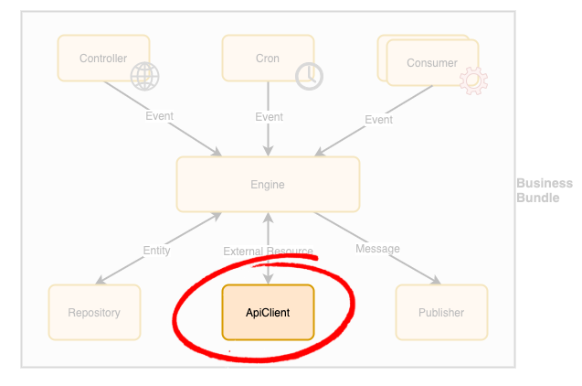

# Business Bundle - ApiClient Component

An ApiClient is a component in a [Business Bundle](Overview.md) responsible to send or retrieve resources with an external system (e.g. CRM, accounting system) via an API mechanism (e.g. REST). 

## Guidelines
In order to build a **production-grade solution**, the following guidelines should be applied to ApiClient components design and implementation:

 - A `ReadApiClient` interface should be defined to allow Business Model objects to be fetched from an external system.
   - This interface provides a **read only** access to external systems to **other components within the same Business Bundle** in order to allow them to **prepare an event or message** to trigger/send.
 - A `FullApiClient` interface must be defined as an **extension of the `ReadApiClient`** interface to add push (aka write) capabilities towards external systems to the Business Bundle.
   - This interface should **only be accessed by the [Engine](Engine.md) component** to ensure business-level consistency and data integrity.
   - This interface should expose **push methods matching the output of the business processes**. 
 - An **interface must be defined for each ApiClient** to expose list of operations needed from the business point of view for interacting with the external system.
 - An implementation of the ApiClient interface **should use the adapter pattern** to interact with a specific external system.
 - This approach **enforces a good decoupling** of the [Business Bundle](Overview.md) being developed and external systems
   - It also allows for an easier migration should the business need to move to a different external provider and/or support multiple ones.
 - **Automated tests must be designed against the ApiClient interface** and executed against the concrete classes
   - It ensures a concrete class is fully compatible with the business contract defined by the interface
   - It ensures the concrete class is truly interchangeable from a business point of view.
 - An ApiClient component must provide a **health check** method that can be **called by the [Engine](Engine.md)**'s own health check to ensure this component is working as expected in production in order to quickly **detect failures with external components**. 
    - This allows any issue that may impact the business to be quickly identified and reported for resolution.
