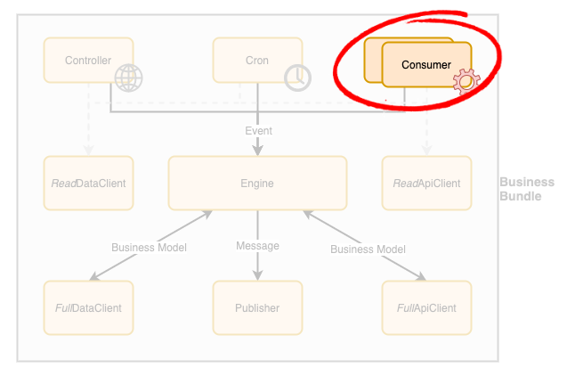

# Business Bundle - Consumer

A consumer, also known as a worker, is a component in a [Business Bundle](Overview.md) that is responsible to handle asynchronous requests. 
It is simply a loop waiting for a known set of messages issued by a trusted source (either a component within the same [Business Bundle](Overview.md) or from another trusted Bundle). 
It typically connects to a message queue and wait for a message to procees. If none is available, it simply waits until one is available.

Unless the associated business process does not support parallel processing (e.g. to enforce data integrity), **this component is designed to scale automatically based on the number of pending messages at any given time**. The scaling approach to use depends on the underlying technology chosen for its implementation.

## Guidelines
In order to build a **production-grade solution**, the following guidelines should be applied to consumer components design and implementation:

 - The consumer simply consumes a message, turns it into an event and pass it on to the [Engine](Engine.md) for actual processing.
 - Along with the event, the consumer must also **build the context** in which the event is being triggered. This will allow the [Engine](Engine.md) to know who is invoking the process. Such a **context should be retrieved from the message metadata** (e.g. header).
   - Context should **include the user on behalf of which** the message has been triggered. 
   - Context should **provide the actual component(s)** that sent the message.
   - This information is invaluable information to have from a debugging and auditing point of view.
 - A **key assumption for the consumer is that messages can be trusted**, which is why a message must only be originated within the bundle or from a trusted bundle inside the solution.
   - As such, the **consumer is not responsible to perform any validation on the message itself**, it can simply take the message and map it an event that can be handled by [Engine](Engine.md).
