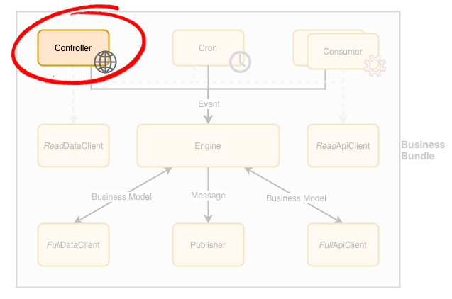

# Business Bundle - Controller

A controller is a [Business Bundle](Overview.md) component responsible to expose a set of API endpoints to handle requests coming from either a view component or an external system. The controller is responsible to create the appropriate business event and pass it on directly to the engine (synchronously) or by sending a message to the [Consumer](Consumer.md) component (asynchronous) for actual processing.

**This component is designed to scale automatically based on the number of incoming requests**. In order to do so, it **must be deployed behind a load balancer**.

## Guidelines
In order to build a **production-grade solution**, the following guidelines should be applied to controller components design and implementation:

- **Asynchronous processing should be adopted** over synchronous processing in the following situations: 
   - When invoking a **long-running business process** 
   - When the business process requested **does not support parallel processing** (e.g. to enforce data integrity).
- A controller simply exposes a specific business process to the outside world. As such, it had a **very limited scope** when compared to other architectures.
- Given that the controller exposes a business process to the outside world, it must **assume the call is insecure until proven otherwise**. Therefore, it **must perform any security and access validation checks** before invoking the [Engine](Engine.md).
- While it may seem overkill or involve an extra overhead to some developers to force the controller to go through the [Engine](Engine.md) rather than manipulating the repository directly, doing so ensures that if the business process invoked can be triggered via other means in the future (e.g. via an asynchronous mean), the same business rules will be applied consistently.
- Given that a controller is tied to the underlying framework used to implement it, there is **no need to define an interface for this component**.
- A key aspect of controller automated tests is to **validate that security and access rules are properly implemented** by the controller in order to prevent any data leakage that could impact the business once it is deployed in production.
   - Even if the [Engine](Engine.md) is also responsible for performing access validation, the controller must still do it in order to detect and reject requests earlier in the process, before involving critical resources in our solution. This can greatly help protect against Denial of Service attacks.
   - **When an access violation is detected**, the controller must **trigger a security exception message** (via a publisher) including the source of call in order to reach the monitoring system. This information can then be used as input to **protect the system against further attacks** using strategies such as:
      - **Blocking offending IP addresses** from reaching the system.
      - **Locking the user’s account and communicating with the account owner** to warn about a potential security breach.
- Controllers should also provide **end-to-end functional testing** to ensure the overall solution is working as expected. 
- A subset of the automated tests should be exposed by the monitoring system to ensure the overall solution is working as expected in production and report any issue as soon as it is introduced. 
- This **monitoring** should be implemented in **two ways**:
   - **Read-only operations** that do not modify data and do not expose confidential information.
   - Using a **test account without confidential data dedicated** to monitor a larger scope of the [Business Bundle](Overview.md).
   - The **second approach is the preferred one for production-grade solutions** since it allows for a more extensive monitoring in production.
- **Ideally, the automated tests at this level should be created using a business language** (e.g. BDD) in order to provide building blocks that can then be used by QA engineers and business analysts to quickly and easily test new business scenarios without involving the development team.
