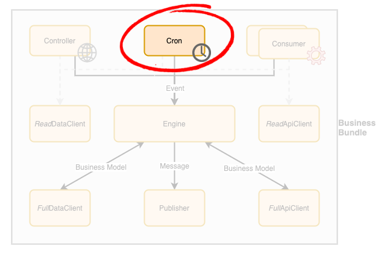

# Business Bundle - Cron

A cron is a [Business Bundle](Overview.md) component responsible to generate events at periodic intervals. 
When this component runs, it does not perform any logic per se, it simply creates a message to send on the bundle's exchange or pass a simple event directly to the [Engine](Engine.md) for actual processing.

If the cron component need to trigger processing on multiple `BusinessModel` objects individually, it should use the messaging approach rather than the event one in order to allow the bundle to scale properly.

## Guidelines
In order to build a **production-grade solution**, the following guidelines should be applied to cron components design and implementation:

- The cron component must detect if another instance of the same task is still running when it starts. 
  - If so, it should log an error with the monitoring system (via the [Engine](Engine.md)) and abort its execution to prevent stability issues that may arise from having multiple tasks executed in parallel.
- A cron component is expected to interact with a [ReadDataClient](DataClient.md) or a [ReadApiClient](ApiClient.md) component in order to fetch data that needs to be processed.
  - The fetched data is then used to create the messages and/or event to trigger the actually business process.
  - A typical example is to retrieve a list of elements that needs to be processed.  