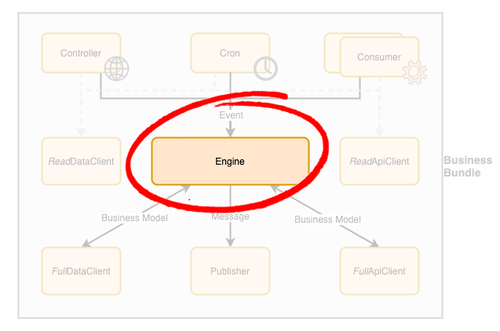

# Business Bundle - Engine Component

**The engine is the core component** of a [Business Bundle](Overview.md) **implementing the actual business logic**. 
The business logic can be triggered via a set of known events coming from various sources:
 - **Scheduled** requests (via a [Cron](Cron.md))
 - **Synchronous** requests (via a [Controller](Controller.md))
 - **Asynchronous** requests (via a Consumer) 

Upon receipt of an event, the engine **coordinates several components** (data and API clients) to gather the extra data required to handle the event received. 
Finally, the result of its processing can be shared using multiple mechanisms:
 - **Persisting data** modifications for future use (via [DataClient](DataClient.md))
 - **Calling** external clients or Business Bundles synchronously (via [ApiClient](ApiClient.md))
 - **Sending asynchronous messages** to other Business Bundle or external clients (via [Publisher](Publisher.md))

The last 2 mechanisms can be used to cleanly trigger other business processes or integrate with 3rd party systems.

## Guidelines
In order to build a **production-grade solution** designed to evolve and adapt to business/technology changing needs, the following guidelines should be applied to the engine component design and implementation:
 - An **engine must only use interface contracts when interacting with the other components of the Bundle** in its business logic implementation for the following reasons: 
   - Allow the business logic to be tested in isolation without any dependency on external systems. 
   - Simplify the adoption of Continuous Integration/Deployment techniques.
   - Concrete implementations must be passed when initializing the engine at runtime.  
   - Components requiring an interface contract:
     - [DataClient](DataClient.md)
     - [ApiClient](ApiClient.md)
     - [Publisher](Publisher.md)
  
 - **Automated unit tests** for the Engine component must also **mock external components** (e.g. data clients, API clients, publishers)
   - Ensure the engine communicates properly with the external components when needed.
 - **Functional tests** for the Engine component *should be* written using a business language in order to be easily understood, validated and modified by business people to ensure they meet business needs. 
   - As such, a BDD framework (e.g. Cucumber, Behat) should be used to define those tests.
 - The engine component must provide a **high-level health check** method that can be **called by a monitoring system** (via the controller) to ensure it is properly working with the set of dependencies it has been configured with (data clients, API clients, publishers). 
   - This allows any issue that may impact the business to be quickly identified and reported for resolution.
 - Each business method exposed by the engine must provide a **calling context argument** to allow the caller to specify the user who is triggering the business process and the path taken to reach it. Doing so **ensures the integrity** of the Business Bundle by:
   - **Applying authorization rules consistently** just before invoking the business process, no matter how it is being triggered.
     - Doing so prevents authorization leakage that may occur when this is performed at the edge of a solution.
     - Upon **authorization failure**, the engine must **trigger a security exception message** (via a publisher) that can be handled by the monitoring system in order to quickly alert the right people.
   - **Simplifying audit process** by ensuring the right amount of information is always available to fill audited business models.
     - It also ensures meaningful and consistent information is present when logging errors for investigation/debugging purposes. 
