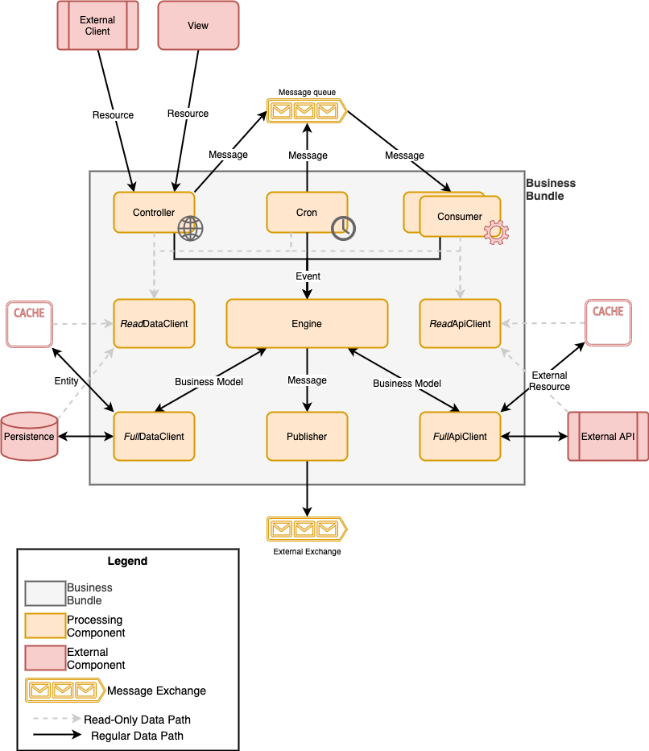

# CodePrimer Process Modeling
Once the data model is established, the next step required to define a software-based business is the data processing model. The processing model defines the **set of components that will interact together in order to accomplish various business goals**. 

Although CodePrimer can generate any artifact, its initial implementation is taking **an opinionated view on how processing should be defined and structured**. It lies somewhere between the *monolithic* and *micro service* trends by liberally borrowing from each into an **approach called Business Bundle**.

## Business Bundle
A *Business Bundle* is a set of components interacting together in predictable ways with clear boundaries in order to easily model and implement a business process using the following patterns:
- A **[Controller](Controller.md)** exposes **Resources** to the **outside world** and turn them into **Messages** and/or **Events**.
- A **[Consumer](Consumer.md)** consumes asynchronous **Messages** and turn them into **Events**.
- A **[Cron](Cron.md)** produces either **Messages** or **Events** at periodic intervals.
- An **[Engine](Engine.md)** acts on **Events** to implement **Business Processes**.
- A **[Repository](Repository.md)** exposes **Entities** to the **Engine** to interact with a **data persistence** layer, such as a database.
- An **[ApiClient](ApiClient.md)** exposes an **Interface** to the **Engine** to interact with **external systems** in synchronous fashion.
- A **[Publisher](Publisher.md)** allows the **Engine** to trigger **Messages** that can be handled by **other Business Bundles** to trigger their own processing.

The figure below shows how the various components interact with each other:

More details about each component can be found in the links below:
- [Engine](Engine.md)
- [Controller](Controller.md)
- [Consumer](Consumer.md)
- [Cron](Cron.md)
- [Repository](Repository.md)
- [ApiClient](ApiClient.md)
- [Publisher](Publisher.md)

## Advantages
This approach to process modeling allows architects and business analysts to clearly think about the set of triggers to consider in terms of data and sources without having to worry to much about the limitations and technicalities of the technology selected.

It allows architects and business analysts to **design business processes around simple questions** such as:

### Synchronous vs Asynchronous
- *Is this process synchronous, asynchronous or both?*
  - **Synchronous**:
    - Expose it via a [Controller](Controller.md)
    - Design a `Resource` to capture the input required by the process
  - **Asynchronous**:
    - Expose it via a [Consumer](Consumer.md)
    - Design a `Message` to capture the input required by the process
    - *Can it support parallel processing ?*
      - **Yes**:
        - Deploy it in *autoscale* mode
      - **No**:
        - Deploy it in *single instance* mode
  - **Both**:
    - Apply both methods above

### External Access
- *Is this process accessible to the outside world (including a web or mobile application)?*
  - **Yes**:
    - Expose it via a [Controller](Controller.md) to enforce user authentication and access control.
    - Design a `Resource` to capture the input required by the process

### Periodic Process
- *Is this process triggered at known intervals?*
  - **Yes**:
    - Expose it va a [Cron](Cron.md)
    - *Is it expected to process an increasing amount of data over time?*
      - **Yes**:
        - Configure it to trigger processing by sending messages to a consumer.
      - **No**:
        - Configure it to invoke the engine directly.

### Data Location
- *Where is the data located for this process?*
  - **Database** or **filesystem**:
    - Design and implement a [Repository](Repository.md) to retrieve it via a set of `Entity` elements
  - **External System**:
    - Design and implement an [ApiClient](ApiClient.md) to retrieve it via `ExternalResource` elements.

### Process Outcome
- *Does this process update data?*
  - **Yes**:
    - See *Data Location* section above
    
- *Can this process be the starting point of another process?*
  - **Yes**:
    - Design a `Message` that can be handled by other processes.
    - Configure a [Publisher](Publisher.md) to advertise the message.
  - **No**:
    - *Is the outcome of potential interest (e.g. user updated)?*
      - **Yes**:
        - Design a `Message` that can be handled by other processes.
        - Configure a [Publisher](Publisher.md) to advertise the message.
          
### Designed for Flexibility
Business requirements change all the time and so does the technological components used to implement them. Therefore, a software architecture should be designed with that in mind.
             
Given that the [Engine](Engine.md) implements the actual business logic, if the answer to the above question changes, the impact is simple and quick to manage as we simply need to change by selecting the appropriate pattern to expose it with very minimal risk.  