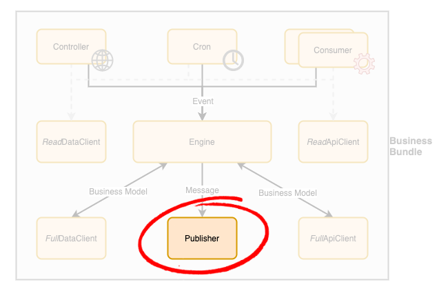

# Business Bundle - Publisher

A Publisher is a component in a [Business Bundle](Overview.md) responsible to send messages triggered by the [Engine](Engine.md) to other business processes using an asynchronous mechanism, such as a message exchange. 

## Guidelines
In order to build a **production-grade solution**, the following guidelines should be applied to publisher components design and implementation:

 - An **interface must be defined for each Publisher** to expose list of operations needed from the business point of view for sending messages.
 - The interface must define monitoring methods to ensure the underlying exchange is available and being consumed.
 - An implementation of the publisher interface must be created to publish a given event to a specific technology (e.g. RabbitMQ or AWS SQS).
 - **Automated tests must be designed against the Publisher interface** and executed against the concrete classes
   - It ensures a concrete class is fully compatible with the business contract defined by the interface
   - It ensures the concrete class is truly interchangeable from a business point of view.
 - A Publisher component must provide a **health check** method that can be **called by the [Engine](Engine.md)**'s own health check to ensure this component is working as expected in production in order to quickly **detect failures with the underlying messaging infrastructure**. 
     - This allows any issue that may impact the business to be quickly identified and reported for resolution.
