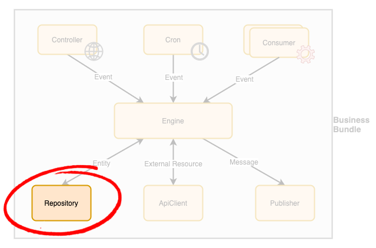

# Business Bundle - Repository Component

The repository is the component in a [Business Bundle](Overview.md) responsible to interface with an underlying storage engine, typically a database, through the manipulation of entities.

## Guidelines
In order to build a **production-grade solution**, the following guidelines should be applied to repository components design and implementation:

 - A repository should **only be accessed by the [Engine](Engine.md) component** to ensure business-level consistency.
 - An **interface must be defined for each repository** to expose the list of operations available, or contract, to other components using it.
 - **Automated tests must be designed against the repository interface** and executed against the concrete classes
   - It ensures a concrete class is fully compatible with the business contract defined by the interface
   - It ensures the concrete class is truly interchangeable from a business point of view.
 - A repository component must provide a **health check** method that can be **called by the [Engine](Engine.md)**'s own health check to ensure this component is working as expected in production in order to quickly **detect failures with the underlying storage engine**. 
    - This allows any issue that may impact the business to be quickly identified and reported for resolution.
